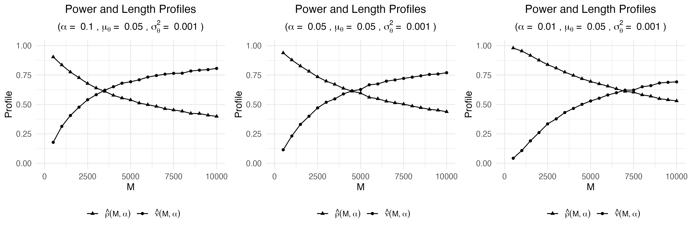
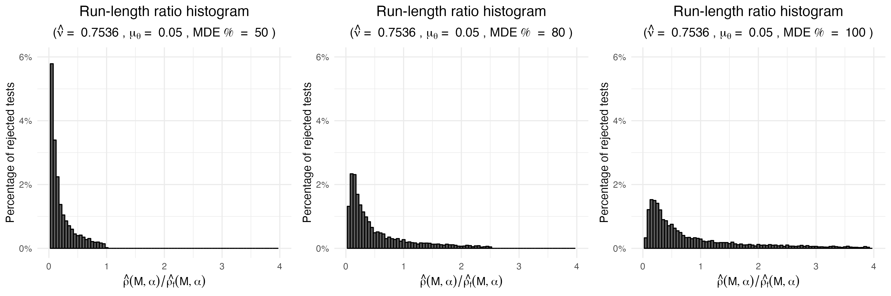

# avi-simulations

Plots of mSPRT sequential test simulations following the paper by Johari et al. [1].

We employ the implementation of the mSPRT by Stenberg [2], available at the repo [erik-stenberg/mixtureSPRT](https://github.com/erik-stenberg/mixtureSPRT).

## Example plots

* **Average power and run-length profiles**: 

* **Run-length ratio histogram**: 

## References

[1] R. Johari, L. Pekelis, and D. J. Walsh. Always Valid Inference: Bringing
Sequential Analysis to A/B Testing. July 16, 2019. arXiv: 1512.04922[math,
stat]

[2] E. Stenberg. mixtureSPRT: Mixture Sequential Probability Ratio Test. R
package version 1.0. 2019.
